# canstd 🕸️🛡️⛈️
canstd : NetSec Threat Detection # Cloud Armor # XSS # SQLi

## Objective

- To explore Cloud Armor's capabilities by testing its threat detection features
- To create Cloud Armor security policy 
- To simulate common web application attacks (Cross-Site Scripting/SQLi) 
- To observe Cloud Armor's logging and blocking behavior
- To secure Google Cloud applications using Cloud Armor

## Cloud Armor Network Security Threat Detection

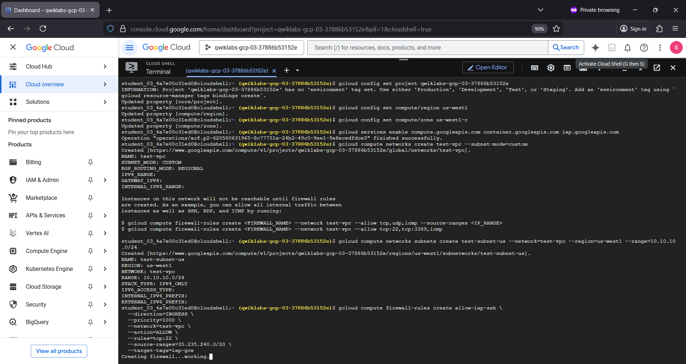

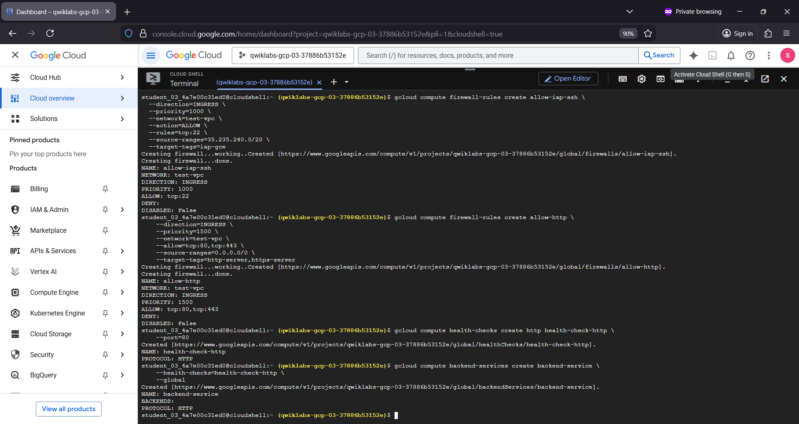

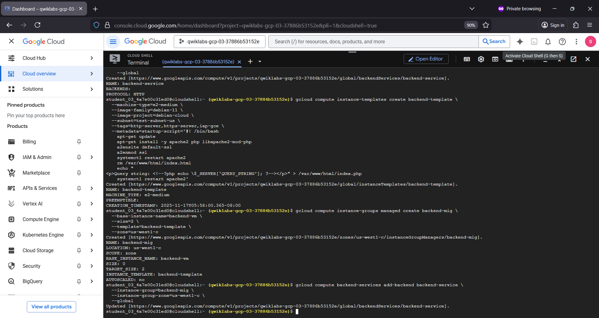

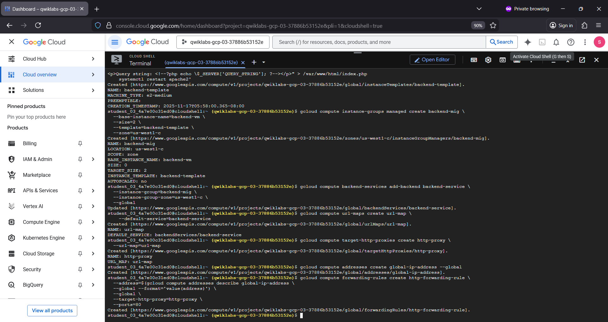

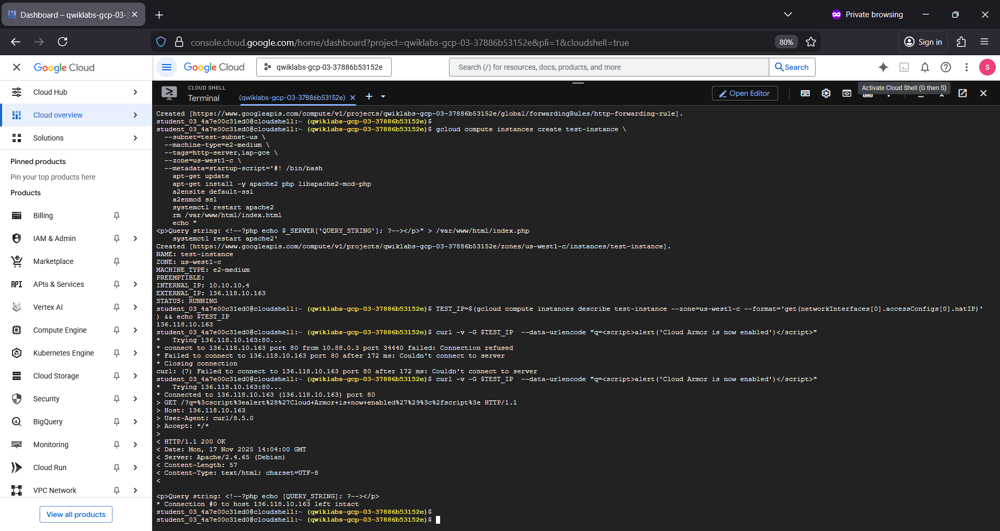

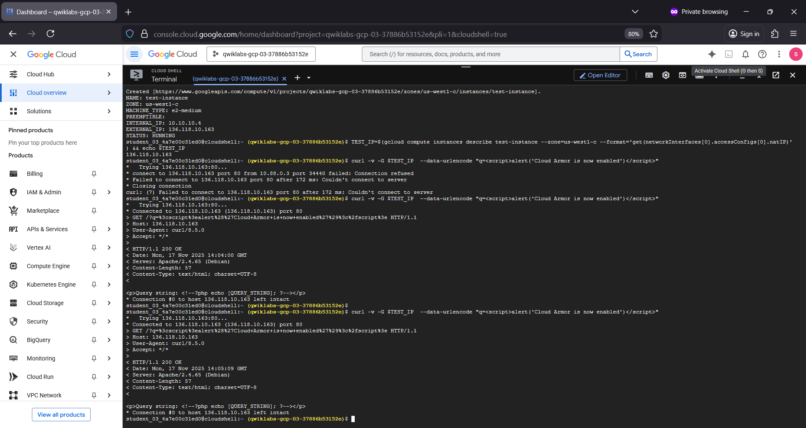

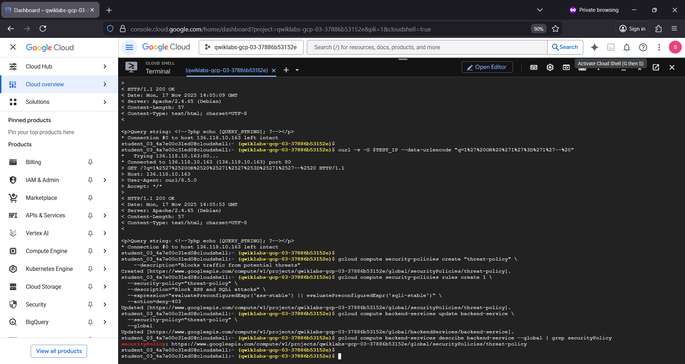

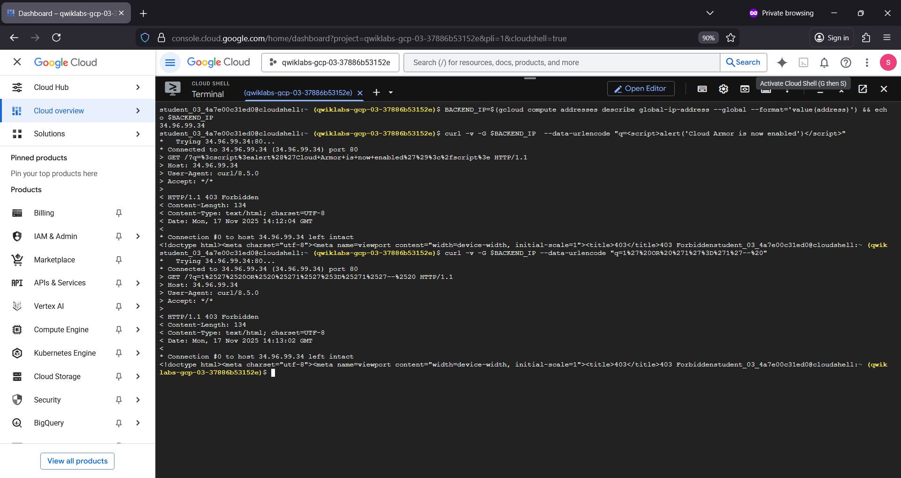

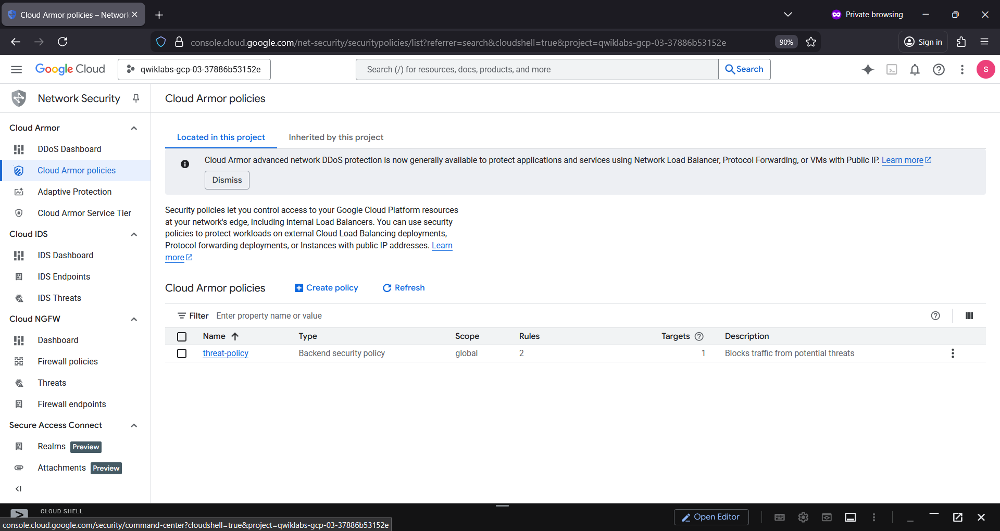

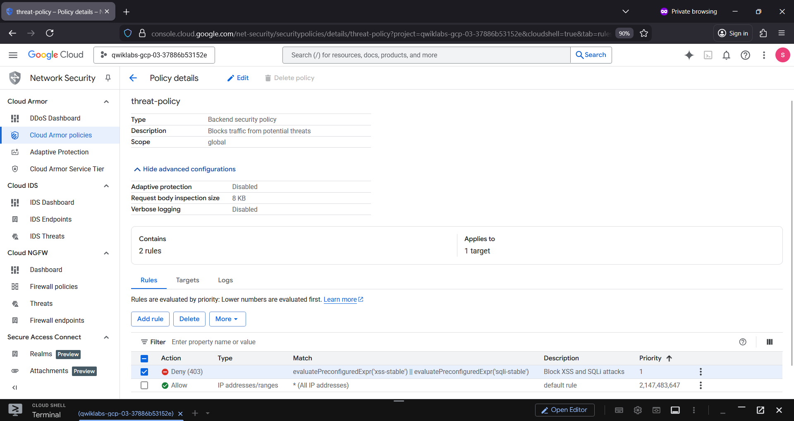

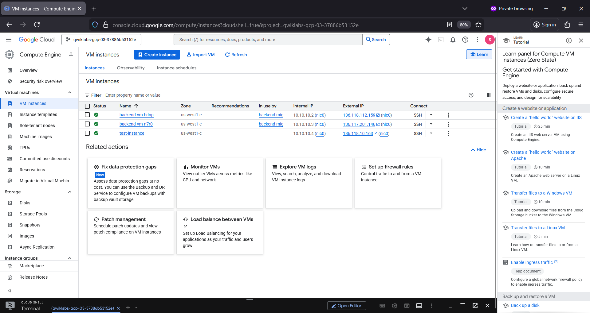

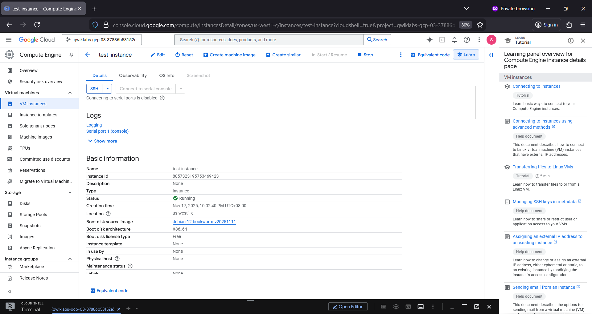

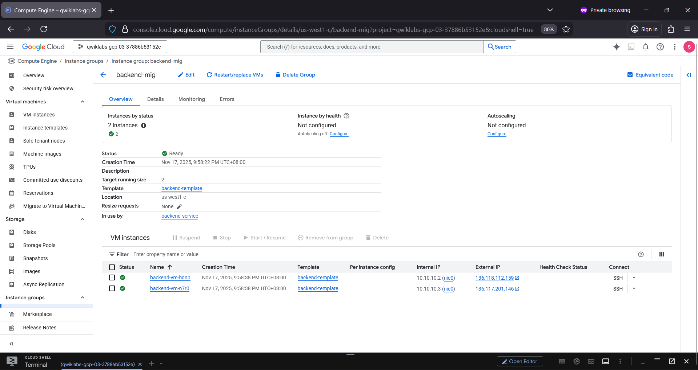

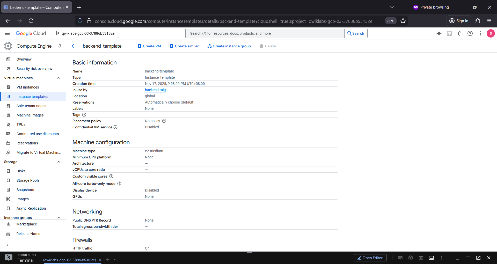

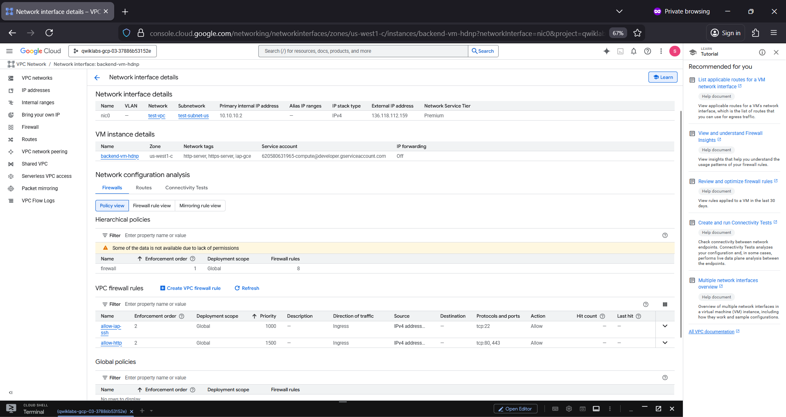

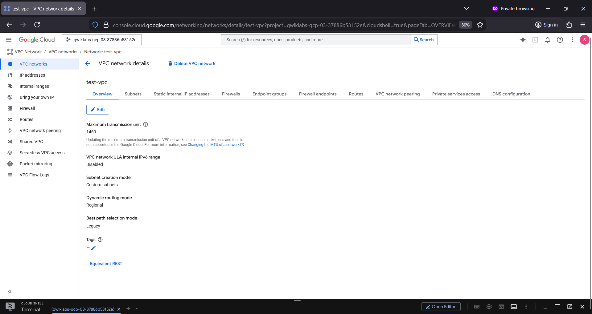

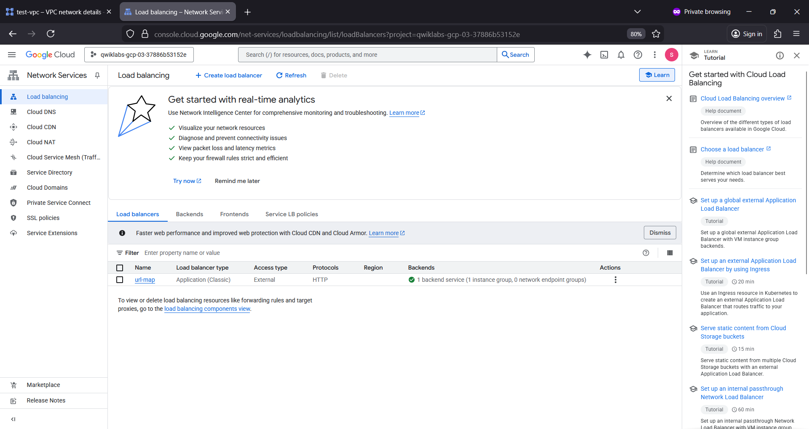

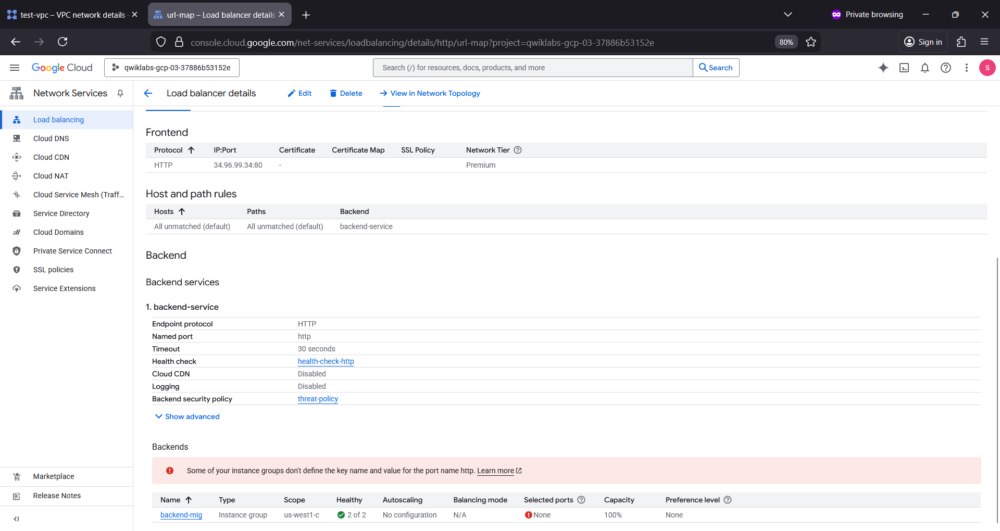
